# Graphify AI

> AI-assisted tabular-to-graph modeling platform for graph analytics, graph quality review, interactive graph exploration, and GNN-ready starter exports.

Graphify AI giúp người dùng biến dữ liệu bảng như CSV giao dịch, rating, đơn hàng hoặc dữ liệu học tập thành graph structure có thể giải thích. Sản phẩm hiện tập trung vào demo nghiên cứu/portfolio: upload hoặc chọn demo dataset, profile schema, đề xuất graph schema, đánh giá chất lượng graph, visualize graph có tương tác, chạy baseline nhẹ và export code NetworkX/PyTorch Geometric.

## Executive Summary

| Hạng mục | Trạng thái |
|----------|------------|
| Product slice | Local prototype/demo gần hoàn chỉnh |
| Core workflow | CSV/demo dataset -> profile -> schema recommendation -> quality -> graph preview -> baseline -> export/share |
| Frontend | Next.js 16, React 18, TypeScript, TailwindCSS, `lucide-react` |
| Backend | FastAPI, Pandas, NetworkX, SQLAlchemy, Pydantic |
| AI layer | Rule-based recommender, optional OpenAI-compatible LLM mode, heuristic fallback |
| Storage local | SQLite metadata, local uploads/exports |
| Deployment target | Vercel frontend + Render backend + Render Postgres + persistent disk |
| CI/CD | GitHub Actions CI and production deploy workflow prepared |
| Hosted demo | [Interactive fixture demo](https://graphify-khanh-demo.vercel.app/demo); full backend remains local |

## Product Pitch

Most business and research datasets start as tables. Before using graph analytics or GNNs, users must decide:

- Which columns should become nodes?
- Which columns represent relationships?
- Which attributes are node, edge, graph, temporal, or label features?
- Whether graph modeling is useful at all, or tabular ML is enough.
- Whether there are leakage, sparsity, imbalance, or scalability risks.

Graphify AI acts as an AI Graph Engineer for this conversion step. It does not only draw a graph from CSV. It explains the schema choice, scores graph suitability, warns about risk, previews graph structure, and exports starter code.

> **Availability:** [Open the public demo](https://graphify-khanh-demo.vercel.app/demo) to compare three synthetic datasets, explore real graph-builder outputs, inspect quality reports, and export JSON. Fresh CSV profiling, LLM integrations, accounts, and persistence require the full local application. See [public demo deployment](docs/public-demo.md).

## Demo Screenshots

| Step | Preview |
|------|---------|
| Landing app entry |  |
| Upload demo picker | 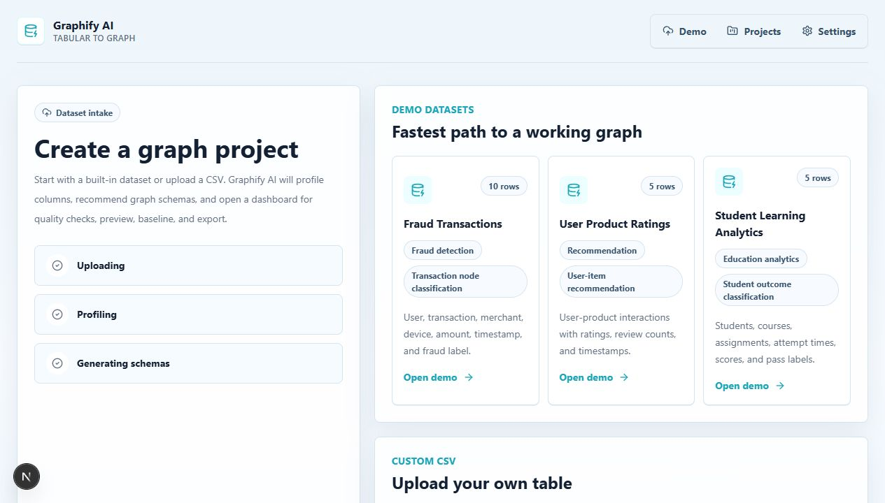 |
| Project dashboard | 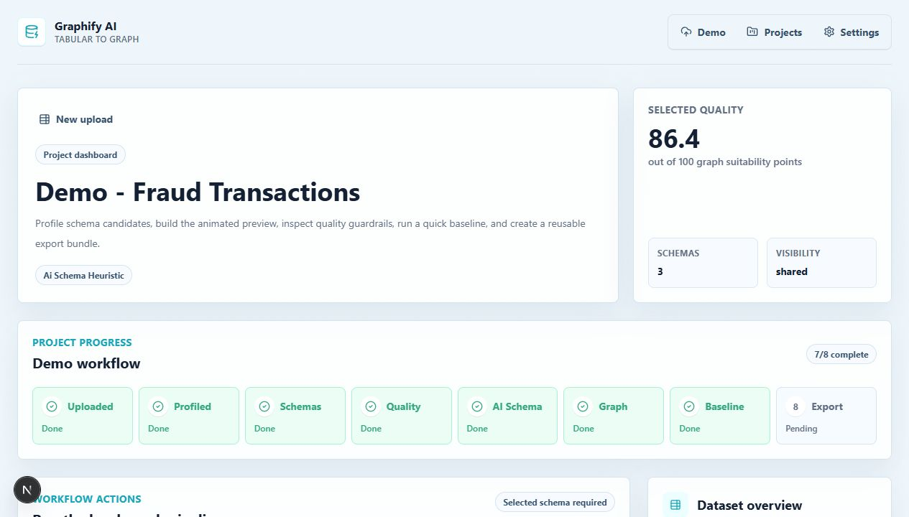 |
| Quality report | 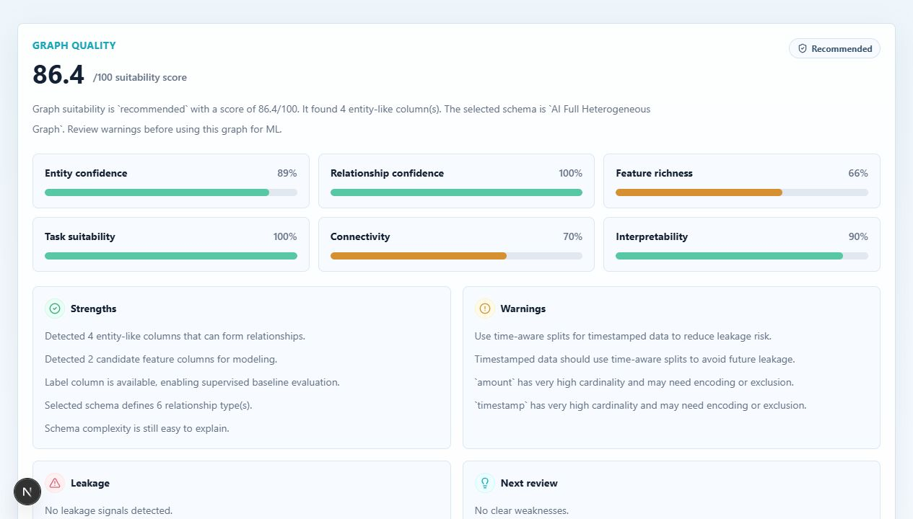 |
| Animated graph explorer | 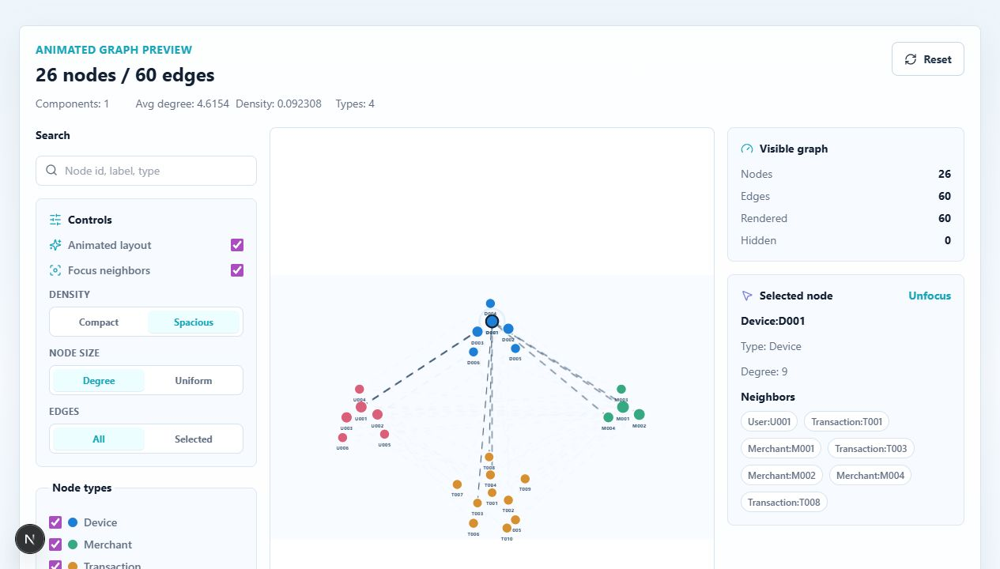 |
| AI schema analysis | 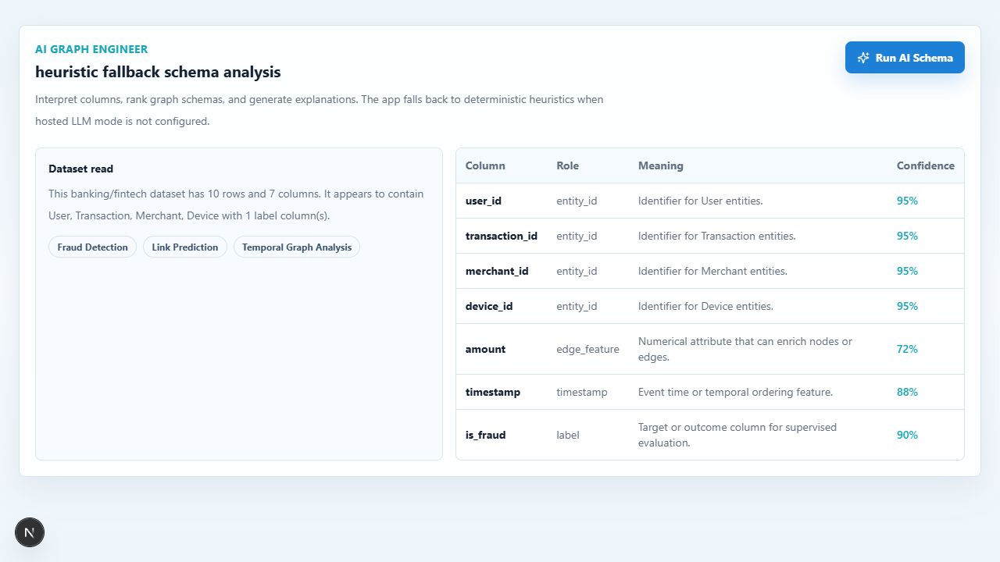 |
| Baseline results | 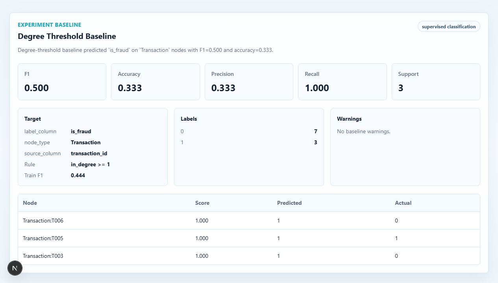 |
| Export and share actions | 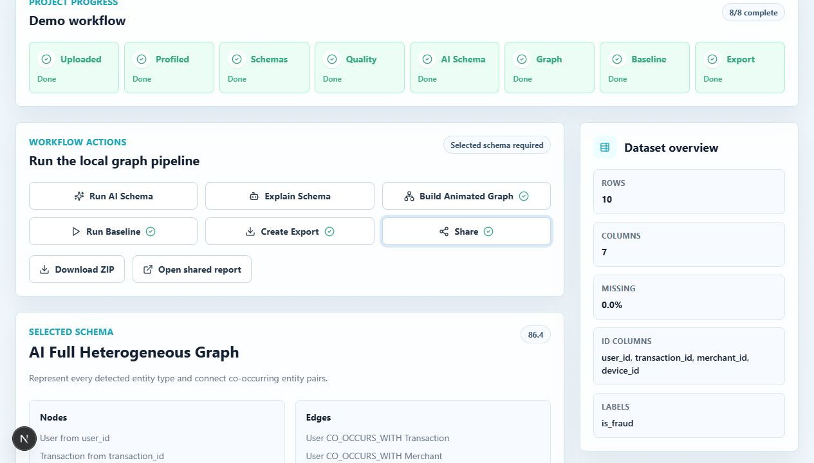 |
| Shared read-only report | 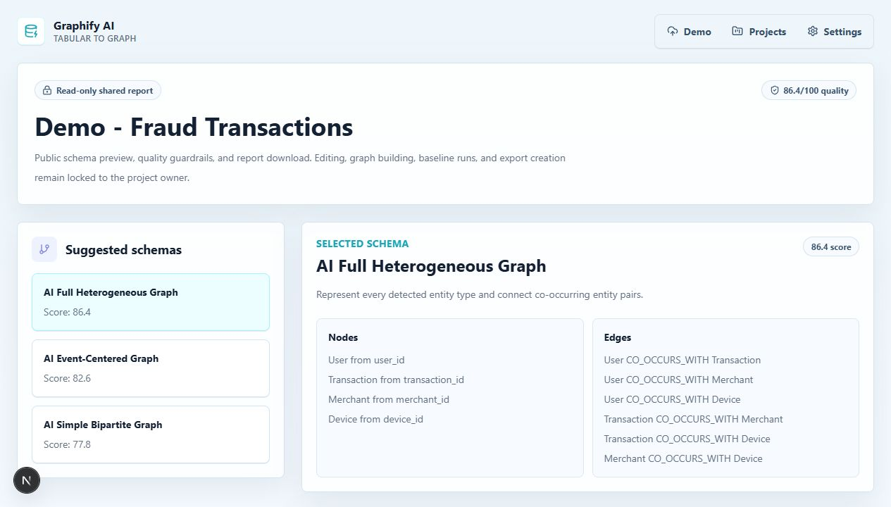 |
| API docs | 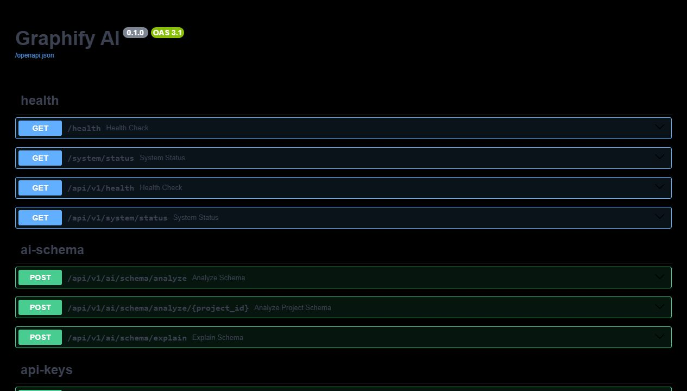 |

## System Architecture

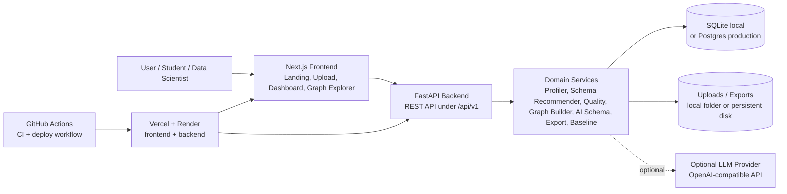

## Application Flow

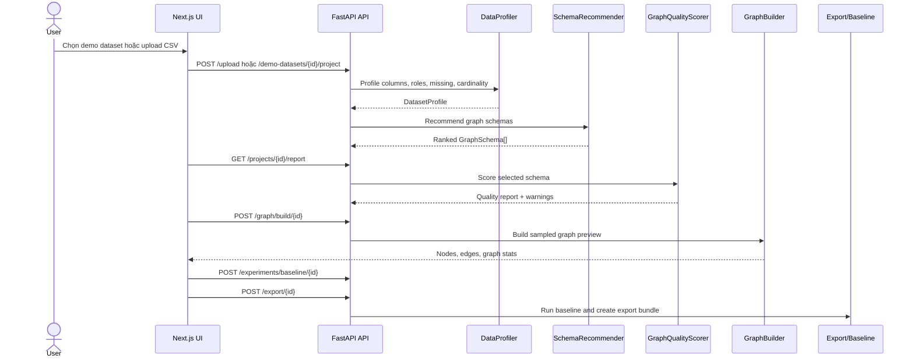

## Core Modules

| Module | Responsibility |
|--------|----------------|
| Data Profiler | Reads CSV with Pandas, detects data types, missing rate, unique count, ID columns, labels, timestamps |
| Rule-based Schema Recommender | Produces graph schema candidates from statistical column profile |
| AI Schema Understanding | Interprets column semantics with optional LLM mode and deterministic fallback |
| Graph Quality Scorer | Scores entity confidence, relationship confidence, feature richness, task suitability, connectivity, interpretability |
| Graph Builder | Builds sampled NetworkX `MultiDiGraph` previews for the frontend |
| Graph Explorer | SVG-based animated graph view with search, filters, selected-node pulse, hover tooltip, neighbor focus, density and edge controls |
| Baseline Runner | Runs lightweight supervised threshold baseline or unsupervised degree ranking fallback |
| Code Generator | Exports schema JSON, node/edge CSV, labels, NetworkX builder, PyG helper, and notebook |
| Product Shell | Basic auth, projects, API keys, share links, read-only reports |

## Database And Storage Model

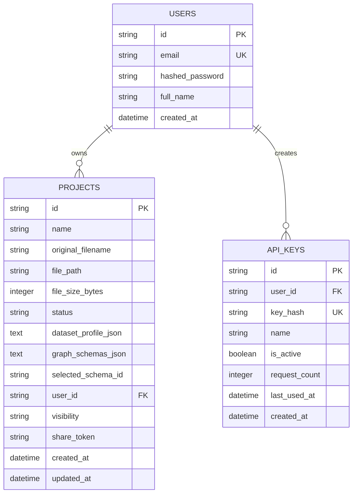

Storage boundaries:

- Metadata is stored through SQLAlchemy. Local mode defaults to SQLite; production target uses Postgres.
- Uploaded CSV files are stored in `UPLOAD_DIR`.
- Generated graph/code exports are stored in `EXPORT_DIR`.
- Runtime artifacts are ignored by git: database files, uploads, exports, `.next`, `node_modules`, cache.

## API Surface

| Area | Endpoints |
|------|-----------|
| Health/status | `GET /health`, `GET /api/v1/health`, `GET /api/v1/system/status` |
| Demo datasets | `GET /api/v1/demo-datasets`, `POST /api/v1/demo-datasets/{id}/project` |
| Upload/profile/schema | `POST /api/v1/upload`, `POST /api/v1/profile/{project_id}`, `POST /api/v1/schema/recommend/{project_id}` |
| Projects/reports/share | `GET /api/v1/projects`, `GET /api/v1/projects/{id}`, `GET /api/v1/projects/{id}/report`, `POST /api/v1/projects/{id}/share` |
| AI schema | `POST /api/v1/ai/schema/analyze/{project_id}`, `POST /api/v1/ai/schema/explain` |
| Graph/quality/experiment/export | `POST /api/v1/graph/build/{project_id}`, `GET /api/v1/quality/{project_id}`, `POST /api/v1/experiments/baseline/{project_id}`, `POST /api/v1/export/{project_id}` |
| Product shell | Auth, API keys, shared read-only reports, public API surface |

## Run Locally

### Prerequisites

- Git
- Python 3.11 or newer (the repository is verified with Python 3.12)
- Node.js 20 or newer and npm
- Docker Desktop, only when using the optional container workflow

Check the installed versions before continuing:

```powershell
git --version
python --version
node --version
npm --version
```

### First-Time Setup (Windows PowerShell)

Clone the repository and create an isolated Python environment from the repository root:

```powershell
git clone https://github.com/KhanhGiauTen/graphiAI.git
cd graphiAI
python -m venv .venv
.\.venv\Scripts\python.exe -m pip install --upgrade pip
.\.venv\Scripts\python.exe -m pip install -r .\backend\requirements.txt
```

Create local configuration files from the safe templates. The backend runs fully in deterministic heuristic mode; no LLM key is required for the normal demo flow.

```powershell
Copy-Item .\backend\.env.example .\backend\.env
Copy-Item .\frontend\.env.local.example .\frontend\.env.local
Set-Location .\frontend
npm ci
Set-Location ..
```

The copied files are intentionally ignored by Git. Do not put any real credential in an example file.

### Start the Backend

Open the first PowerShell terminal at the repository root:

```powershell
cd backend
..\.venv\Scripts\python.exe -m uvicorn app.main:app --host 127.0.0.1 --port 8000 --reload
```

The first startup creates the local SQLite database, upload directory, and export directory automatically. Keep this terminal running.

### Start the Frontend

Open a second PowerShell terminal at the repository root:

```powershell
cd frontend
npm run dev -- --hostname 127.0.0.1 --port 3000
```

Open `http://127.0.0.1:3000`, select **Start demo**, then choose **Fraud Transactions** for the shortest complete product walkthrough.

### Verify the Local Stack

With the backend still running, open a third terminal at the repository root:

```powershell
.\.venv\Scripts\python.exe .\scripts\smoke_test.py --api-url http://127.0.0.1:8000/api/v1
```

Run the full automated checks when changing code:

```powershell
cd backend
..\.venv\Scripts\python.exe -m pytest -q
cd ..\frontend
npm run typecheck
npm run build
npm audit --audit-level=moderate
```

### Run With Docker Compose (Optional)

Docker Compose starts the frontend, backend, and a persistent local Docker volume. It uses heuristic AI mode by default and does not require a cloud account.

```powershell
docker compose up --build
```

Stop containers with `Ctrl+C`. To remove the local Docker volume as well, use `docker compose down -v`; this deletes only the Compose-managed database, uploads, and exports.

### Local URLs

| Surface | URL |
|---------|-----|
| Frontend | `http://127.0.0.1:3000` |
| Backend health | `http://127.0.0.1:8000/health` |
| Runtime status | `http://127.0.0.1:8000/api/v1/system/status` |
| API docs | `http://127.0.0.1:8000/docs` |

### Common Local Issues

| Symptom | Resolution |
|---------|------------|
| `python` is not recognized | Install Python 3.11+ and restart PowerShell, or use the Python launcher: `py -3.12 -m venv .venv`. |
| Frontend cannot call the API | Confirm the backend health URL responds, then check `frontend/.env.local` contains `NEXT_PUBLIC_API_URL=http://127.0.0.1:8000/api/v1`; restart `npm run dev` after changing it. |
| Browser shows a CORS error | Keep the frontend on port 3000 or add its exact origin to `backend/.env` `ALLOWED_ORIGINS`, then restart the backend. |
| Port 3000 or 8000 is busy | Stop the old process, or change both the frontend API URL and backend CORS origin to matching replacement ports. |
| Docker daemon is unavailable | Start Docker Desktop, or use the two-terminal native workflow above. |

## Environment Variables

Backend:

```env
APP_NAME=Graphify AI
APP_VERSION=0.1.0
ENVIRONMENT=development
DATABASE_URL=sqlite:///graphify.db
UPLOAD_DIR=uploads
EXPORT_DIR=exports
MAX_UPLOAD_SIZE_MB=50
ALLOWED_ORIGINS=http://localhost:3000,http://127.0.0.1:3000
AI_SCHEMA_MODE=heuristic
OPENAI_BASE_URL=https://api.openai.com/v1
OPENAI_API_KEY=
LLM_MODEL=local-heuristic
SECRET_KEY=change-this-in-production
RATE_LIMIT_ENABLED=true
```

Frontend:

```env
NEXT_PUBLIC_API_URL=http://127.0.0.1:8000/api/v1
```

Optional LLM mode:

```env
AI_SCHEMA_MODE=llm
OPENAI_API_KEY=your_api_key
OPENAI_BASE_URL=https://api.openai.com/v1
LLM_MODEL=gpt-4.1-mini
```

Invalid, unavailable, or malformed LLM output falls back to the deterministic heuristic path.

## Public Repository Safety

The repository is designed to be shareable as a portfolio project. The committed environment files contain placeholders only, runtime folders are ignored, and the bundled datasets use synthetic identifiers such as `U001`, `M001`, and `S001` rather than real customer data.

Before changing a repository from private to public, verify the following:

- Do not stage `.env`, `.env.local`, `.env.production`, database files, uploaded CSV files, generated exports, or cloud service credentials. The `.gitignore` protects these common local files, but `git status` is the final check.
- Treat every `NEXT_PUBLIC_*` variable as public. Next.js embeds it in the browser bundle; only put a public API base URL there, never an API key, token, database URL, or `SECRET_KEY`.
- Keep `OPENAI_API_KEY`, `SECRET_KEY`, deployment hooks, Vercel tokens, and database passwords in local environment files, hosting dashboards, or GitHub Actions Secrets only.
- If a credential is ever committed, revoke or rotate it immediately. Removing the file in a later commit does not remove it from Git history.
- Commit metadata is public too. Check `git log --format=%ae` before publishing. If it exposes a personal email address, rewrite the history before public release, then use a GitHub noreply address for future commits.

The scan performed for this repository found no known API key, cloud access key, private key, OAuth token, or JWT pattern in the current tracked files or reachable commit history. This is a practical repository audit, not a replacement for provider-side secret scanning and credential rotation policies.

## Deployment Architecture

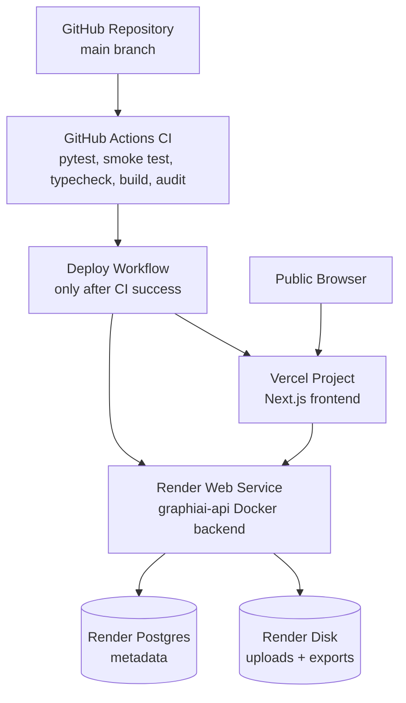

Current deploy target:

- Frontend: Vercel project rooted at `frontend`.
- Backend: Render Docker web service using `render.yaml`.
- Database: Render Postgres through `DATABASE_URL`.
- Persistent files: Render disk mounted at `/var/data`.
- CD secrets: `RENDER_DEPLOY_HOOK_URL`, `VERCEL_TOKEN`, `VERCEL_ORG_ID`, `VERCEL_PROJECT_ID`, `PROD_API_URL`, `PROD_FRONTEND_URL`.

Detailed deployment instructions are in [docs/deployment.md](docs/deployment.md).

## Verification

Backend:

```powershell
cd backend
..\.venv\Scripts\python.exe -m pytest -q
```

API smoke test after backend is running:

```powershell
.\.venv\Scripts\python.exe .\scripts\smoke_test.py --api-url http://127.0.0.1:8000/api/v1
```

Frontend:

```powershell
cd frontend
npm run typecheck
npm run build
npm audit --audit-level=moderate
```

Smoke test coverage:

- Creates a fraud demo project.
- Verifies schema recommendation.
- Builds graph preview.
- Generates project report and graph quality score.
- Runs baseline experiment.
- Creates export bundle.

## Demo Datasets

| Dataset | Domain | Primary task |
|---------|--------|--------------|
| `fraud_transactions.csv` | Banking/FinTech | Fraud detection |
| `user_ratings.csv` | E-commerce | Recommendation/link prediction |
| `student_courses.csv` | Education | Student performance / learning analytics |

The Upload page exposes these datasets directly, so a complete demo does not require manual file selection.

## Current Capability Matrix

| Capability | Status |
|------------|--------|
| CSV upload and profiling | Implemented |
| Rule-based graph schema recommendation | Implemented |
| AI schema understanding | Implemented with provider + heuristic fallback |
| Graph quality guardrails | Implemented |
| Animated graph preview | Implemented |
| Schema report JSON download | Implemented |
| NetworkX/PyG starter export | Implemented |
| Lightweight baseline experiment | Implemented |
| Auth/projects/share/API keys | Basic implementation |
| Docker Compose | Implemented |
| CI checks | Implemented |
| Render/Vercel deployment config | Prepared |
| Production observability | Pending |
| Persistent distributed rate limit | Pending |
| True Node2Vec/GraphSAGE in-app training | Pending |

## Roadmap

| Stage | Goal |
|-------|------|
| Demo hardening | Keep local and hosted demo stable, fast, and easy to evaluate |
| Deployment | Complete Render/Vercel dashboard setup, secrets, and post-deploy smoke test |
| Graph ML depth | Add true Node2Vec/GraphSAGE experiments and benchmark datasets |
| Production hardening | Add object storage, Redis-backed rate limits, observability, and stronger access control |
| Research extension | Compare graph schema choices across fraud, recommendation, and education datasets |

## Documentation Map

| File | Purpose |
|------|---------|
| [docs/ARCHITECTURE.md](docs/ARCHITECTURE.md) | Living architecture map for future sessions |
| [docs/implement-notes.html](docs/implement-notes.html) | Implementation decision log |
| [docs/demo_walkthrough.md](docs/demo_walkthrough.md) | Local demo and screenshot capture guide |
| [docs/deployment.md](docs/deployment.md) | Render/Vercel deployment and post-deploy smoke guide |

## One-Line Pitch

Graphify AI is an AI-assisted platform that converts tabular datasets into explainable graph structures, scores graph modeling suitability, visualizes relationships, and exports graph-learning starter code.
