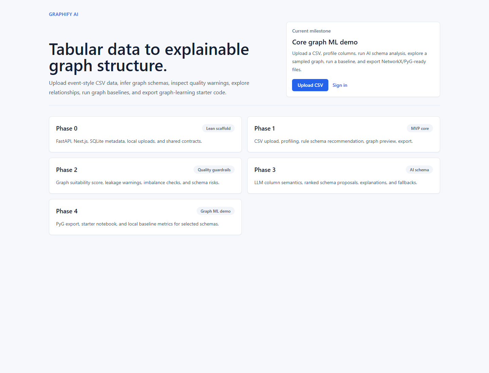
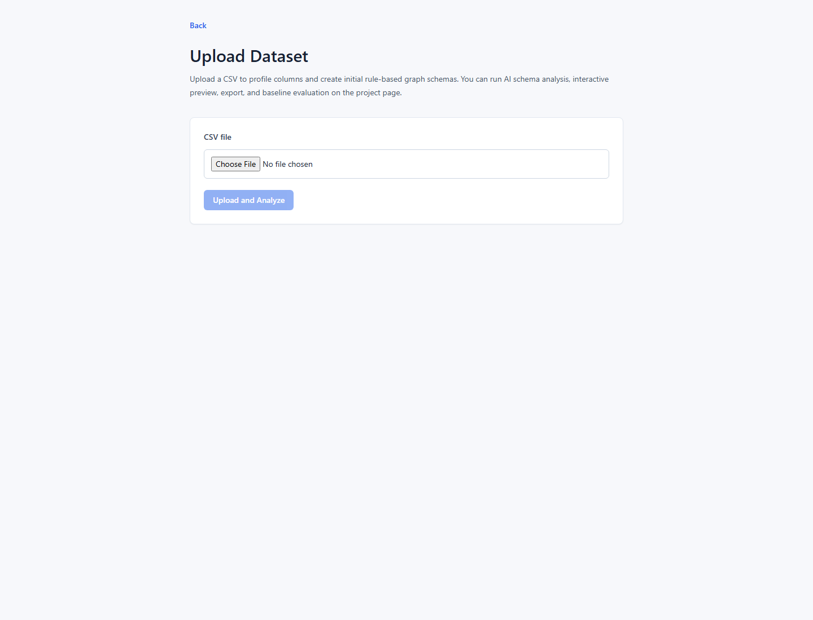
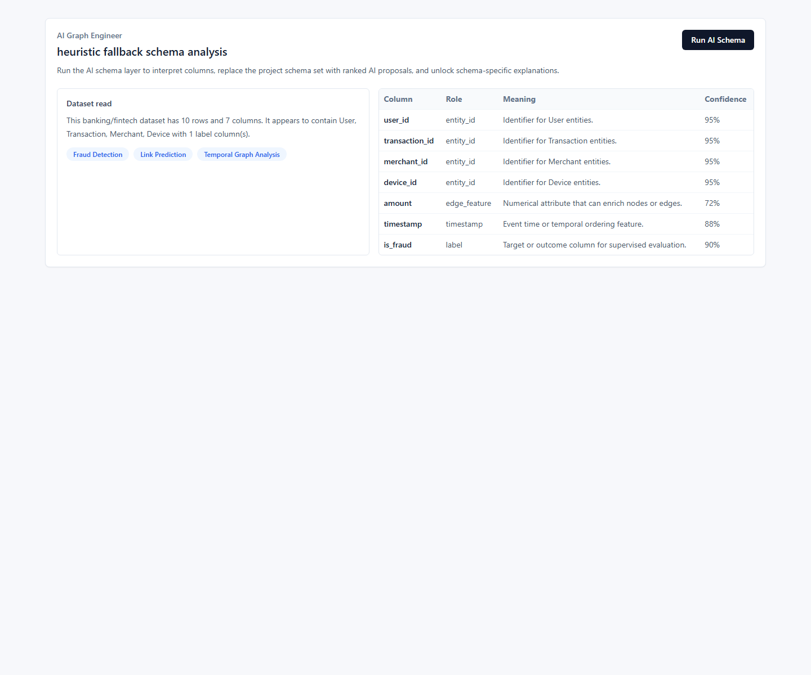
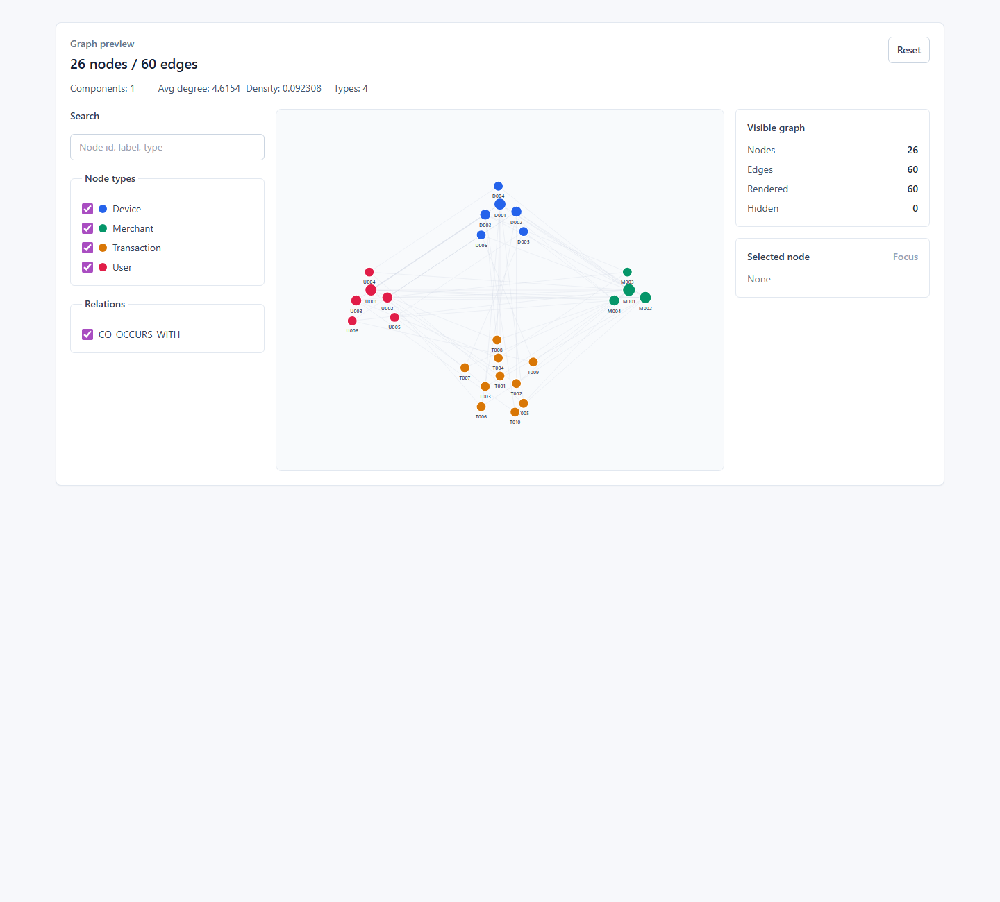
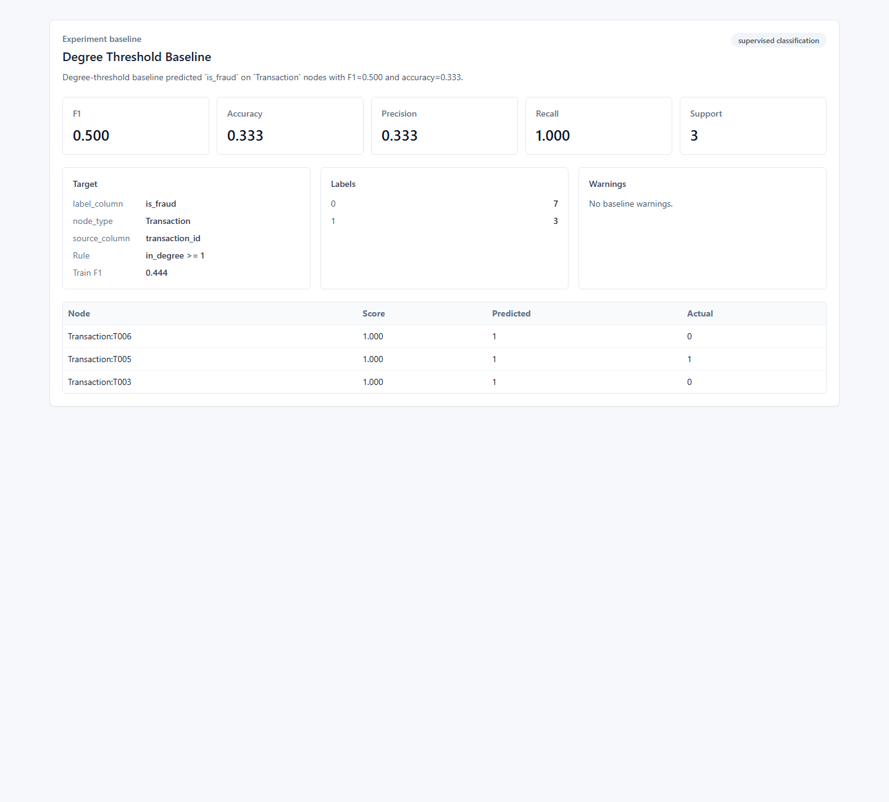
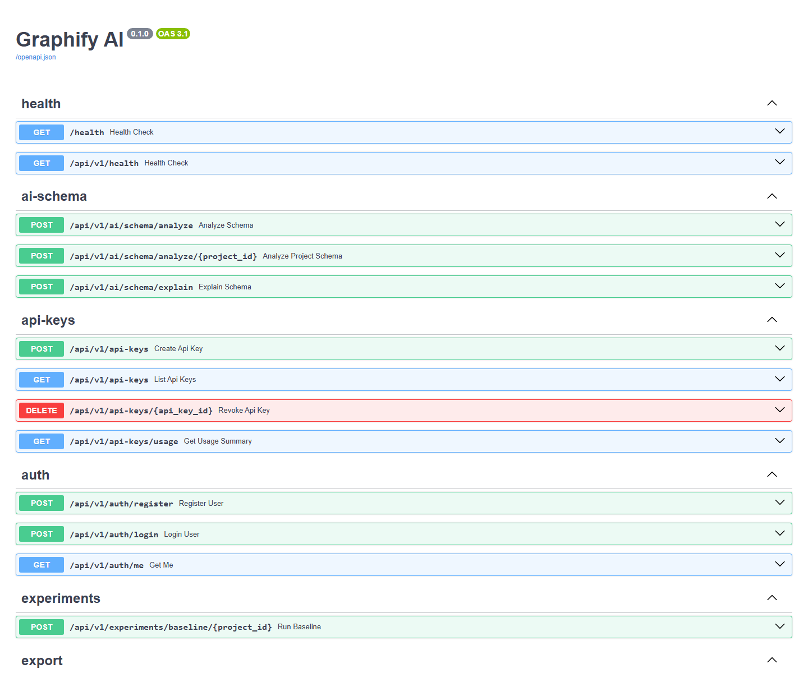

# Graphify AI

> AI-assisted tabular-to-graph modeling platform for graph analytics and GNN-ready exports.

Graphify AI helps users upload tabular datasets, infer useful graph structures, inspect graph quality, visualize graph samples, run a lightweight graph baseline, and export runnable graph construction code. The current product slice is focused on single-table event datasets with repeated entity IDs, such as fraud transactions, ratings, orders, student-course activity, and access logs.

## Product Thesis

Most business and research datasets start as tables. Before using graph analytics or GNNs, users must decide which columns are entities, which relationships are meaningful, which features are safe, and whether graph modeling is useful at all. Graphify AI acts as a practical graph modeling assistant for that conversion step.

## Lean Roadmap

| Phase | Focus | Key Deliverable |
|-------|-------|-----------------|
| Phase 0 | Lean scaffold | Next.js + FastAPI + SQLite/local files, health checks, shared types |
| Phase 1 | MVP core | CSV upload -> profiling -> rule schema -> graph preview -> NetworkX export |
| Phase 2 | Graph quality guardrails | Quality score, leakage checks, "should this be a graph?" warnings |
| Phase 3 | AI schema understanding | LLM column semantics, 3 schema proposals, explanation, rule fallback |
| Phase 4 | PyG export | Jupyter notebook + PyG `HeteroData` export + one baseline model |
| Phase 5 | Productization | Login, saved projects, share links, deployment |
| Phase 6 | Platform expansion | In-app experiments, teams, public API, advanced AutoML |

The core local demo now covers the Phase 1-4 story: upload, profile, recommend schemas, run AI-assisted schema understanding, inspect an interactive graph preview, export NetworkX/PyG artifacts, and run a lightweight graph baseline.

## Current Status

| Area | Status |
|------|--------|
| CSV upload and profiling | Implemented |
| Rule-based schema recommendation | Implemented |
| AI schema understanding | Implemented with OpenAI-compatible provider and heuristic fallback |
| Graph quality guardrails | Implemented in backend services |
| Interactive graph preview | Implemented with search, filters, node focus, and details |
| Export bundle | Implemented: schema, nodes, edges, labels, NetworkX, PyG helper, notebook |
| Baseline experiment runner | Implemented: degree/feature threshold baseline with fallback ranking |
| Product accounts/sharing/API keys | Basic implementation |
| Production hardening | Still pending: deployment, stronger auth policy, rate limiting, CI, observability |

## Local Demo Screenshots

| Step | Preview |
|------|---------|
| Landing page |  |
| Upload page |  |
| Project AI schema |  |
| Interactive graph explorer |  |
| Baseline results |  |
| API docs |  |

See [docs/demo_walkthrough.md](docs/demo_walkthrough.md) for the full demo flow and phase/progress notes.

## MVP Priority

| Module | Priority | Target Phase |
|--------|----------|--------------|
| CSV upload and profiling | 5 | Phase 1 |
| Rule-based graph schema recommendation | 5 | Phase 1 |
| Graph quality score and warnings | 5 | Phase 2 |
| Demo datasets | 5 | Phase 1 |
| Graph preview | 4 | Phase 1 |
| Export NetworkX + schema files | 4 | Phase 1 |
| LLM semantic analyzer | 4 | Phase 3 |
| PyG notebook export | 3 | Phase 4 |
| In-app GNN training | 2 | Phase 6 |
| Multi-user/team/API | 1-2 | Phase 5-6 |
| Advanced AutoML | 1 | Phase 6+ |

## First Demo Story

```text
Upload transaction CSV
  -> profile columns and detect roles
  -> recommend rule-based graph schemas
  -> run AI Graph Engineer for semantic schema proposals
  -> explain nodes, edges, features, labels
  -> preview a sampled graph interactively
  -> run a lightweight graph baseline
  -> export schema + graph tables + NetworkX/PyG starter code
```

## Initial Tech Stack

```text
Frontend: Next.js 16 + TypeScript + TailwindCSS
Backend:  FastAPI + Python 3.11+ + Pandas + NetworkX + SQLAlchemy
Storage:  SQLite for metadata, local uploads/exports for MVP
AI/ML:    Rule-based recommender, OpenAI-compatible LLM provider, PyG export, local graph baseline
Infra:    Local dev scripts first, Docker/deployment after MVP is stable
```

PostgreSQL, Redis, Celery, teams, public API, and in-app model training are deliberately deferred until the core workflow is useful.

## Local Setup

Backend:

```powershell
cd backend
..\.venv\Scripts\python.exe -m pip install -r requirements.txt
..\.venv\Scripts\python.exe -m pytest
..\.venv\Scripts\python.exe -m uvicorn app.main:app --host 127.0.0.1 --port 8000 --reload
```

Frontend:

```powershell
$env:PATH = "$PWD\.tools\node-v20.12.2-win-x64;$env:PATH"
cd frontend
npm install
npm run typecheck
npm run dev -- --hostname 127.0.0.1 --port 3000
```

If you use your own Node.js installation, the `.tools` PATH step is not required.

## Optional LLM Setup

By default, AI schema analysis runs in deterministic heuristic fallback mode. To enable a hosted OpenAI-compatible model, create `backend/.env`:

```env
AI_SCHEMA_MODE=llm
OPENAI_API_KEY=your_api_key
OPENAI_BASE_URL=https://api.openai.com/v1
LLM_MODEL=gpt-4.1-mini
```

Restart the backend after changing environment variables. Invalid, unavailable, or hallucinated LLM output falls back to the local heuristic path.

## Main Local URLs

| Surface | URL |
|---------|-----|
| Frontend app | `http://127.0.0.1:3000` |
| Backend health | `http://127.0.0.1:8000/health` |
| API docs | `http://127.0.0.1:8000/docs` |

## Implementation Timeline

| Milestone | Result |
|-----------|--------|
| Phase 0 | Lean FastAPI + Next.js scaffold with SQLite/local file storage |
| Phase 1 | CSV upload, profiling, rule schema recommendation, graph preview, export |
| Phase 2 | Graph quality scoring and leakage/suitability guardrails |
| Phase 3 | AI schema understanding with OpenAI-compatible provider and local fallback |
| Phase 4 | PyG/notebook export and in-app baseline experiment runner |
| Phase 5/6 slice | Basic auth, saved projects, share links, API keys, and public API surface |

## Project Completion Estimate

| Scope | Estimate |
|-------|----------|
| Local portfolio demo | 90-92% |
| Practical prototype | 70% |
| Production SaaS | 35-40% |

The prototype is strong enough to demonstrate the product thesis locally. Production work remains around deployment, CI/CD, access control, rate limits, observability, and more serious graph ML experiment infrastructure.

## Demo Datasets

| File | Domain | Key Task |
|------|--------|----------|
| `fraud_transactions.csv` | Banking/FinTech | Fraud detection |
| `user_ratings.csv` | E-commerce | Recommendation/link prediction |
| `student_courses.csv` | Education | Performance prediction |

## Phase Files

- `phase0_architecture_setup.md`
- `phase1_mvp_core.md`
- `phase2_graph_quality_guardrails.md`
- `phase3_ai_schema.md`
- `phase4_pyg_export.md`
- `phase5_productization.md`
- `phase6_platform_expansion.md`

## One-Line Pitch

Graphify AI is an AI-assisted platform that converts tabular datasets into explainable graph structures, warns when graph modeling may be a poor fit, visualizes relationships, and exports graph-learning starter code.
